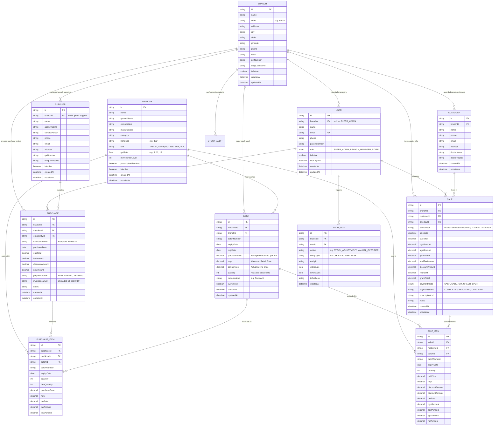

# Kiara Medicals — Database Architecture & ER Design

## 1. Overview
Kiara Medicals is a multi-branch medical store management system. The database architecture is built around **strict branch-level isolation** using a shared schema with tenant discriminator (`branchId`) on all operational tables, while centralizing master catalogs (Medicines) and high-level management for Super Admins.

---

## 2. Entity-Relationship (ER) Diagram

---

## 3. Key Multi-Tenancy & Data Isolation Rules

1. **Strict Branch Isolation**:
   - `Batch`, `Supplier`, `Purchase`, `PurchaseItem`, `Customer`, `Sale`, and `SaleItem` include `branchId`.
   - Any query executing from `/api/store/*` is intercepted by `requireBranchScope` middleware to inject `where: { branchId: req.user.branchId }`.
   - Branch users CANNOT override or pass `branchId` from request parameters/body to access another store's records.

2. **Shared Master Catalog**:
   - `Medicine` acts as a centralized master table (brand names, composition, HSN codes, default GST rates) to avoid catalog duplication across shops.
   - However, **pricing, batch, and inventory quantities are strictly branch-scoped** via the `Batch` table.

3. **Composite Unique Constraints**:
   - Unique Batch per Branch: `@@unique([branchId, medicineId, batchNumber])`
   - Unique Bill Number per Branch: `@@unique([branchId, billNumber])`
   - Unique Supplier Invoice per Branch: `@@unique([branchId, supplierId, invoiceNumber])`

4. **Indexes for High-Performance POS Queries**:
   - Fast medicine search: `CREATE INDEX idx_medicine_name ON Medicine(name, genericName)`
   - Fast batch lookup during checkout: `CREATE INDEX idx_batch_branch_med ON Batch(branchId, medicineId, expiryDate)`
   - Expiry alert monitoring: `CREATE INDEX idx_batch_expiry ON Batch(branchId, expiryDate)`
   - Daily/weekly sales reporting: `CREATE INDEX idx_sale_branch_date ON Sale(branchId, saleDate)`
